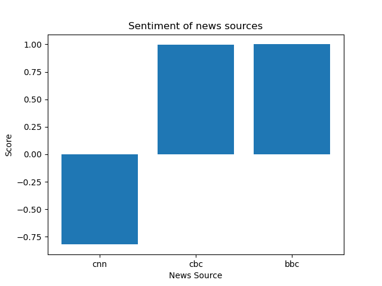

# Super Star Research
This research will surely win awards

This project analyzed the VADER Scores of the following three news articles from early December to determine which news source had the most negative thing to say about chatGPT.

December 7
[https://www.bbc.com/news/technology-63861322](https://www.bbc.com/news/technology-63861322)

December 8
[https://www.cnn.com/2022/12/05/tech/chatgpt-trnd/index.html](https://www.cnn.com/2022/12/05/tech/chatgpt-trnd/index.html)

December 9
[https://www.cbc.ca/news/business/chatgpt-artificial-intelligence-1.6681401](https://www.cbc.ca/news/business/chatgpt-artificial-intelligence-1.6681401)


## Dataset

|    | url                                                                        |   neg |   neu |   pos |   compound |
|---:|:---------------------------------------------------------------------------|------:|------:|------:|-----------:|
|  0 | https://www.bbc.com/news/technology-63861322                               | 0.119 | 0.767 | 0.114 |    -0.8202 |
|  1 | https://www.cbc.ca/news/business/chatgpt-artificial-intelligence-1.6681401 | 0.03  | 0.863 | 0.106 |     0.9985 |
|  2 | https://www.cnn.com/2022/12/05/tech/chatgpt-trnd/index.html                | 0.044 | 0.815 | 0.141 |     0.9997 |


## Analysis

The following code was used to generate the visualization

```python

labels = ['cnn','cbc','bbc']

plt.bar(labels, dataset["compound"])
plt.title("Sentiment of news sources")
plt.ylabel("Score")
plt.xlabel("News Source")
plt.savefig("graph.png")
plt.show()

```




Based on this anaylsis we can see that the *CNN* had the most negative score and therefore dislikes chatGPT the most.